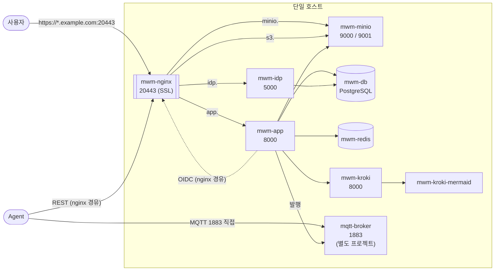

# 배포 아키텍처 및 구축 가이드

본 문서는 MW App 시스템의 구성 요소와 배포 방안을 정의한다.

**두 가지 구성을 함께 설명한다.**

| 구성 | 용도 | 근거 파일 |
| :--- | :--- | :--- |
| **단일 호스트** | 개발·검증. 리포지토리를 받아 그대로 기동하는 형태 | `docker-compose.yml`, `nginx/nginx.conf` |
| **2대 분리** | 운영. 시각화 도구를 별도 서버로 분리 | 아래 4절 |

> 도메인·호스트명은 **예시**다. `example.com`, `app-server`, `viz-server` 를
> 자신의 환경에 맞게 바꿔 쓴다. 리포지토리에 포함된 개발용 설정은 `*.mwm.local` 을 쓴다.

---

## 1. 구성 요소

| 컨테이너 | 포트 | 역할 | 필수 |
| :--- | :--- | :--- | :--- |
| `mwm-nginx` | 20080 → 20443 | 리버스 프록시 / SSL Termination. 호스트명으로 라우팅 | ✅ |
| `mwm-app` | 8000 | 핵심 애플리케이션 (Flask-AppBuilder) | ✅ |
| `mwm-db` | 5432 (호스트 5433) | PostgreSQL. 앱 DB(`mw`)와 IDP DB(`idp`) | ✅ |
| `mwm-redis` | 6379 (내부) | 세션 저장소 | ✅ |
| `mwm-minio` | 9000 (S3 API) / 9001 (콘솔) | S3 호환 오브젝트 스토리지 | ✅ |
| `mwm-idp` | 5000 | **OAuth2 / OIDC 인증 서버.** SSO 로그인 | 선택 |
| `mwm-kroki` | 8000 (호스트 8081) | 다이어그램 렌더링 | 선택 |
| `mwm-kroki-mermaid` | 내부 | Kroki mermaid 플러그인 | `mwm-kroki` 사용 시 |
| `mqtt-broker` | 1883 | MQTT 브로커(Mosquitto). 에이전트 실시간 명령 전달 | 선택 |

> `mqtt-broker` 는 **별도 compose 프로젝트**로 관리한다 (이 리포지토리의
> `docker-compose.yml` 에 포함되지 않는다).

### 1-1. 단일 호스트 구성도



## 2. 서비스 엔드포인트

Nginx 가 **호스트명**으로 라우팅한다. 모든 외부 트래픽은 `20443`(SSL) 하나로 들어온다.
`80` 으로 들어오면 `20443` 으로 301 리다이렉트한다.

| 호스트명 | upstream | 용도 |
| :--- | :--- | :--- |
| `app.example.com:20443` | `mwm-app:8000` | App UI / REST API |
| `idp.example.com:20443` | `mwm-idp:5000` | OIDC 인증 서버 |
| `minio.example.com:20443` | `mwm-minio:9001` | MinIO 웹 콘솔 |
| `s3.example.com:20443` | `mwm-minio:9000` | **S3 API** (콘솔과 포트가 다르다) |

> `minio.` 와 `s3.` 는 **서로 다른 포트**를 가리킨다. 콘솔(9001)과 S3 API(9000)를
> 같은 호스트명으로 묶으면 파일 업로드·다운로드가 동작하지 않는다.

리포지토리의 개발용 설정(`nginx/nginx.conf`)은 같은 구조에 `*.mwm.local` 을 쓴다.

### 2-1. 컨테이너에서 자기 자신을 부를 때 — `host-gateway`

**OIDC 로그인은 앱 컨테이너가 nginx 를 경유해 IDP 에 접속한다.** 그런데 컨테이너 안에서
`idp.example.com` 을 `127.0.0.1` 로 보내면 자기 자신이라 닿지 않는다.

`docker-compose.yml` 은 `extra_hosts` 로 이 이름들을 **docker 게이트웨이(= 호스트)** 에
매핑해, 호스트에 게시된 `20443` 으로 되돌아 들어오게 한다.

```yaml
extra_hosts:
  - "app.mwm.local:host-gateway"
  - "idp.mwm.local:host-gateway"
  - "minio.mwm.local:host-gateway"
  - "s3.mwm.local:host-gateway"
  - "mqtt-broker.local:host-gateway"
```

> **IP 를 직접 적지 말 것.** `172.x.x.x` 같은 게이트웨이 IP 는 docker 네트워크를
> 재생성하면 바뀐다. `host-gateway` 는 Docker **20.10+** 가 런타임에 치환하는 특수값이다.
>
> nginx 컨테이너를 직접 가리키는 방법(`idp.mwm.local:mwm-nginx`)은 쓸 수 없다.
> nginx 는 컨테이너 안에서 `443` 을 듣는데 설정된 URL 은 `:20443` 이라 포트가 어긋난다.

## 3. MQTT 브로커 (선택 구성)

에이전트 실시간 명령 전달을 쓰는 경우에만 필요하다. 구성하지 않으면 `MQTT_ENABLED=False`
로 두고 기존 REST 폴링으로 동작한다.

- **Nginx 를 경유하지 않는다.** 에이전트가 브로커의 `1883` 에 직접 접속한다.
- 브로커가 **별도 compose 프로젝트**라 컨테이너 이름으로 해석되지 않는다.
  `extra_hosts` 의 `mqtt-broker.local:host-gateway` 를 통해 호스트에 게시된 `1883` 으로 접근한다.
  `MQTT_BROKER_HOST` 기본값이 `mqtt-broker.local` 이다.
- 방화벽에서 **에이전트 → 브로커 1883** 인바운드를 허용해야 한다.
- 현재 구성은 **평문 1883** 이다. 운영 적용 시 TLS(8883) 또는 mTLS 검토가 필요하다
  ([mTLS_based_auth.md](mTLS_based_auth.md)).
- 브로커 설정·ACL·계정 구성은 [HOWTO_016](HOWTO_016_mqtt_realtime_command.md) 참고.

## 4. 2대 분리 운영 구성

시각화 도구(Kroki)가 리소스를 많이 쓰므로 별도 서버로 분리할 수 있다.

| 서버 | 역할 | 컨테이너 |
| :--- | :--- | :--- |
| **`app-server`** | Web / App / DB / 인증 | `mwm-nginx`, `mwm-app`, `mwm-db`, `mwm-redis`, `mwm-minio`, `mwm-idp`, `mqtt-broker` |
| **`viz-server`** | 시각화 | `mwm-kroki`, `mwm-kroki-mermaid` |

각 서버에서 별도 `docker-compose.yml` 을 유지하거나 통합 관리(Docker Swarm 등)를 쓴다.

### 4-1. `app-server` — 분리 시 달라지는 부분

```yaml
services:
  mwm-app:
    environment:
      # Kroki 를 다른 서버로 분리한 경우, 컨테이너 이름 대신 주소로 지정한다
      KROKI_URL: http://<viz-server의_IP>:8081
      # 단일 호스트 구성에서는 컨테이너 이름을 쓴다
      #   KROKI_URL: http://mwm-kroki:8000
    ...
```

`mwm-kroki`, `mwm-kroki-mermaid` 서비스 정의는 `app-server` 에서 제거한다.

### 4-2. `viz-server`

```yaml
services:
  mwm-kroki:
    container_name: mwm-kroki
    image: yuzutech/kroki:latest
    environment:
      - KROKI_MERMAID_HOST=mwm-kroki-mermaid
    ports:
      - "8081:8000"

  mwm-kroki-mermaid:
    container_name: mwm-kroki-mermaid
    image: yuzutech/kroki-mermaid:latest
```

## 5. Nginx 설정

`nginx/nginx.conf` 가 실제 설정이며, 아래는 그 구조를 요약한 것이다.
운영에서는 `server_name` 과 인증서 경로만 자신의 도메인으로 바꾼다.

```nginx
# HTTP -> HTTPS 리다이렉트
server {
    listen      80;
    server_name *.example.com example.com;
    return 301 https://$host:20443$request_uri;
}

# App UI / REST API
server {
    listen      443 ssl;
    server_name app.example.com;
    ssl_certificate     /etc/nginx/certs/server.crt;
    ssl_certificate_key /etc/nginx/certs/server.key;

    location / {
        proxy_pass http://mwm-app:8000;
        proxy_set_header Host              $host;
        proxy_set_header X-Real-IP         $remote_addr;
        proxy_set_header X-Forwarded-For   $proxy_add_x_forwarded_for;
        proxy_set_header X-Forwarded-Proto $scheme;
    }
}

# OIDC 인증 서버
server {
    listen      443 ssl;
    server_name idp.example.com;
    ...
    location / { proxy_pass http://mwm-idp:5000; }
}

# MinIO 웹 콘솔
server {
    listen      443 ssl;
    server_name minio.example.com;
    client_max_body_size 0;          # 대용량 업로드 허용
    ...
    location / { proxy_pass http://mwm-minio:9001; }
}

# MinIO S3 API  (콘솔과 다른 포트)
server {
    listen      443 ssl;
    server_name s3.example.com;
    client_max_body_size 0;
    ...
    location / { proxy_pass http://mwm-minio:9000; }
}
```

> **컨테이너를 nginx 와 같은 네트워크에 두면 `proxy_pass` 에 컨테이너 이름을 쓸 수 있다.**
> 2대 분리 구성에서 `viz-server` 처럼 다른 서버에 있는 대상은 IP 로 지정한다.

인증서 생성 절차는 [HOWTO_005](HOWTO_005_generate_ssl_certificates.md) 참고.

## 6. 방화벽 요건

| 방향 | 포트 | 용도 |
| :--- | :--- | :--- |
| 사용자망 → `app-server` | **20443** | Nginx 서비스 포트 (HTTPS) |
| 사용자망 → `app-server` | 20080 | HTTP → HTTPS 리다이렉트 (선택) |
| 에이전트 → `app-server` | **20443** | REST 폴링 / 결과 보고 |
| 에이전트 → `app-server` | **1883** | MQTT (선택 구성 시) |
| `app-server` → `viz-server` | **8081** | Kroki (2대 분리 시) |

> `mwm-db` 의 `5433` 은 **호스트에서 DB 에 직접 접근할 때만** 필요한 선택 바인딩이다.
> 외부에 열 필요가 없다.

## 7. 배포 절차

### 7-1. 단일 호스트

1. Docker **20.10 이상** 및 Docker Compose 설치 (`host-gateway` 요구사항)
2. SSL 인증서 준비 → `nginx/certs/`
3. IDP 서명 키 준비 → `idp/certs/` ([HOWTO_007](HOWTO_007_idp_installation_guide.md))
4. `.env.example` 을 `.env` 로 복사해 비밀값 설정
5. 호스트 `/etc/hosts` 에 서비스 호스트명 등록 (개발 환경의 경우)
6. 이미지 빌드 — **2단계이며 base 부터 빌드해야 한다**
   ([HOWTO_001](HOWTO_001_create_docker_image.md))
   ```bash
   docker build -t mwm-base -f Dockerfile.base .
   docker build -t mwm-app  -f Dockerfile.app  .
   ```
7. `docker compose up -d`
8. DB 마이그레이션 및 관리자 계정 생성
   ```bash
   docker exec -it mwm-app flask fab create-admin
   ```
9. 브라우저 접속 테스트

### 7-2. 2대 분리

1. 양쪽 서버에 Docker 및 Docker Compose 설치
2. 소스 동기화 후 서버별 `docker-compose.yml` 분할 적용 (4절)
3. `viz-server` 의 Kroki 먼저 기동
4. `app-server` 기동 — DB → 앱 순
5. `app-server` 에 Nginx 설정 및 SSL 인증서 적용
6. 방화벽 규칙 적용 (6절)
7. 지정된 도메인으로 접속 테스트

## 8. 관련 문서

| 문서 | 내용 |
| :--- | :--- |
| [HOWTO_001](HOWTO_001_create_docker_image.md) | 도커 이미지 2단계 빌드 |
| [HOWTO_002](HOWTO_002_docker_image_migration.md) | 폐쇄망 이미지 이전 |
| [HOWTO_005](HOWTO_005_generate_ssl_certificates.md) | SSL 인증서 생성 |
| [HOWTO_007](HOWTO_007_idp_installation_guide.md) | IDP 서버 설치 |
| [HOWTO_006](HOWTO_006_minio_oidc_integration_guide.md) | MinIO OIDC 연동 |
| [HOWTO_016](HOWTO_016_mqtt_realtime_command.md) | MQTT 브로커 구성·ACL |
| [mTLS_based_auth.md](mTLS_based_auth.md) | mTLS 기반 인증 검토 |
